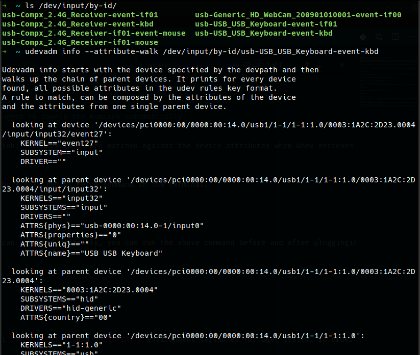
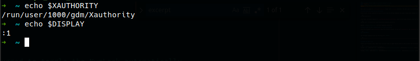

Udev rules are placed in **/etc/udev/rules.d/** folder with **.rules** extension. The udev rules are matched against the device attributes when Udev receives device events. In this post, we are going to automate the toggle of NumLock when an external keyboard is connected or removed using two lines of udev rules. We are going to use **numlockx** command when our defined Udev rule is matched.

## Identifying the device and its attributes

First of all, we must identify our device (in our case an external keyboard) by simply running below command in the terminal.

```sh
ls /dev/input/by-id/
```

In my case, my external keyboard is **usb-USB_USB_Keyboard-event-kbd**. Yours can be named differently, you can run the above command before and after plugging in the keyboard to identify it. Once we've our keyboard's device id, next we find out the device attributes to use in Udev rules by running below command.

```sh
udevadm info --attribute-walk /dev/input/by-id/keyboard_device_id
```

Replace **keyboard_device_id** with your keyboard's device id.

<div class="Image__Medium">
  
  <figcaption>udevadm info of an external keyboard</figcaption>
</div>

## Identifying the user's Authorization file path and Display

Since we are going to use **numlockx** which uses the X11 session, we must set **XAUTHORITY** and **DISPLAY** environment variables for udev system. In order to find out the path of authorization file, we run the below command. If the output is empty, then it is **/home/username/.Xauthority** (Replace the **username** with your username).

```sh
echo $XAUTHORITY
```

The following commands prints out the value for `DISPLAY`.

```sh
echo $DISPLAY
```

<div class="Image__Medium">
  
  <figcaption>XAUTHORITY and DISPLAY values</figcaption>
</div>

## Adding the Udev rules

Finally we are going to add a Udev rules file with rules to toggle NumLock based on device events and attributes. Make sure to replace **authorization_file_path**, **display_value**, and **username** values with your own, then save the rules in **/etc/udev/rules.d/usb-keyboard.rules** file.

```sh
# Turn on NumLock when a usb keyboard is plugged in.
ACTION=="add", SUBSYSTEM=="usb", ENV{XAUTHORITY}="authorization_file_path", ENV{DISPLAY}="display_value", ATTRS{product}=="USB Keyboard", RUN+="/usr/bin/su username -c '[ -f $XAUTHORITY ] && /usr/bin/numlockx on'"

# Turn off NumLock when a usb keyboard is unplugged.
ACTION=="remove", SUBSYSTEM=="usb", ENV{XAUTHORITY}="authorization_file_path", ENV{DISPLAY}="display_value", ATTRS{product}=="USB Keyboard", RUN+="/usr/bin/su username -c '[ -f $XAUTHORITY ] && /usr/bin/numlockx off'"

```

Run the following commands to reload Udev rules without rebooting your machine.

```sh
sudo su
udevadm control --reload-rules
udevadm trigger
```

## Toggle NumLock in startup

Adding this line of code to your **~/.bashrc** or **~/.zshrc** file will automatically toggle NumLock if you attached or detached a keyboard while your machine was off or in-sleep.

```sh
[[ `lsusb | grep -i keyboard` != "" ]] && numlockx on || numlockx off
```
